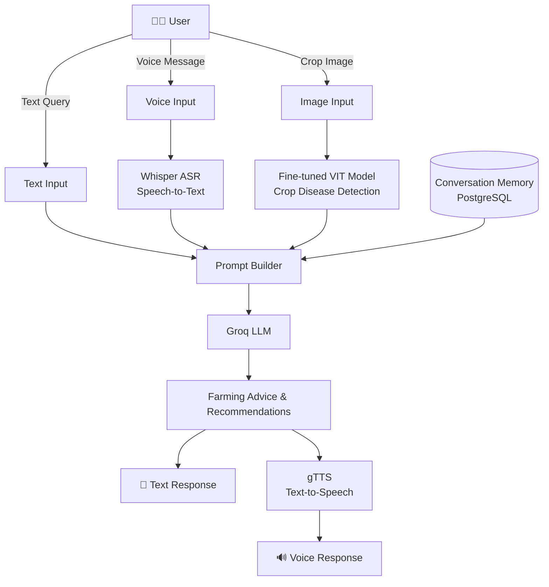

  

A Telegram bot that helps farmers gets instant crop diagnosis by uploading photo of defected crop & gives smart farming suggestion by sending text & voice message.

# ✨ Features

1. **Reliable Crop Disease Diagnosis**

    This system uses a *fine-tuned Vision Transformer* (ViT) model *(google/vit-base-patch16-224)* to detect diseases in rice, corn, and wheat from crop images.

    The model can identify the following diseases:

    * *Rice* : Bacterial Blight, Black Point, Blast, and Blight
    * *Corn* : Brown Spot, Common Rust, Fusarium Foot Rot, and Gray Leaf Spot
    * *Wheat* : Leaf Blight, Tungro, and Wheat Blast

    *Fine Tuned Model* : [Hhsjsnns/Rice-Wheat-Corn-DiseaseCLS](https://huggingface.co/Hhsjsnns/Rice-Wheat-Corn-DiseaseCLS)

2. **Smart Farming Advice**

    The system uses the *Groq LLM* to provide farming advice and disease prevention tips based on the detected crop disease.

3. **Voice Support**

    Farmers can ask questions using their voice. *Whisper ASR* converts speech into text, the *Groq LLM* generates a response, and **gTTS** converts the response back into speech.

4. **Conversation Memory**

    The system stores previous conversations in a *PostgreSQL* database. This helps the AI remember the conversation and provide more relevant and personalized responses.

5. **Multilingual Support**

    The system supports both Hindi and English, making it easier for farmers to interact in their preferred language.

<<<<<<< HEAD
## 🔄 Workflow

=======
>>>>>>> d2862085c5893644be4393d2789b041283cd6f32

## 🎬 Demo

## 📽️ Demo

▶️ **[Watch Demo](assets/Demo.mp4)**

